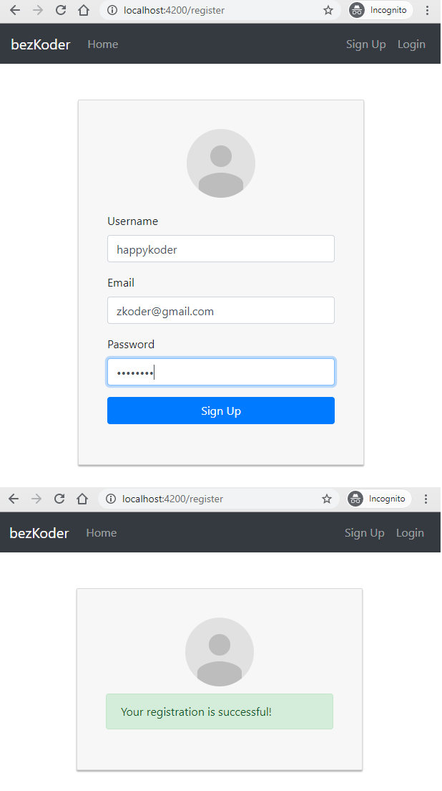
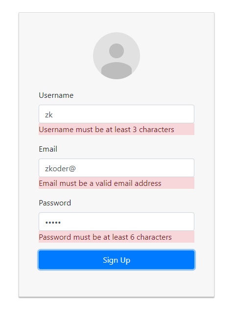
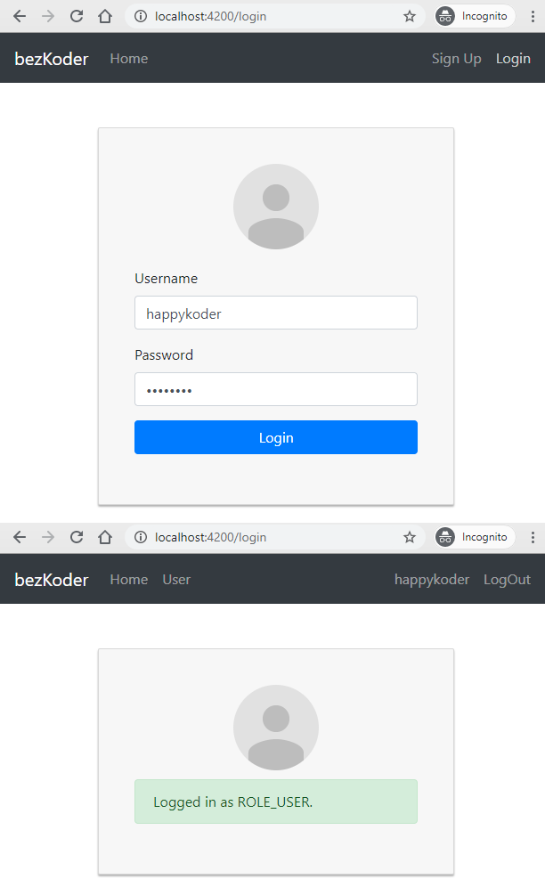
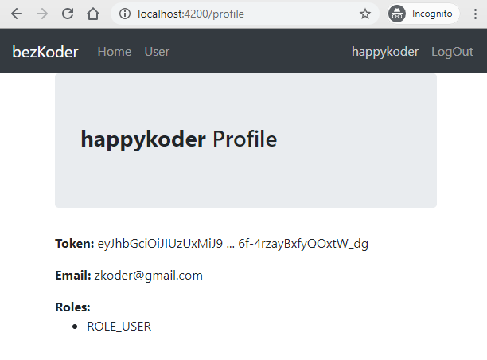
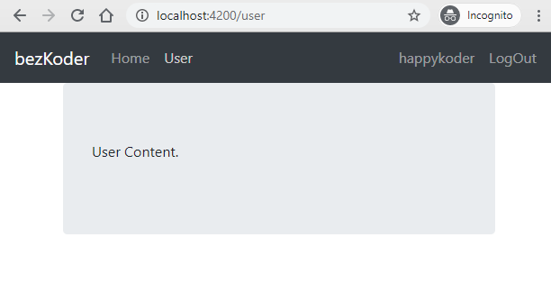
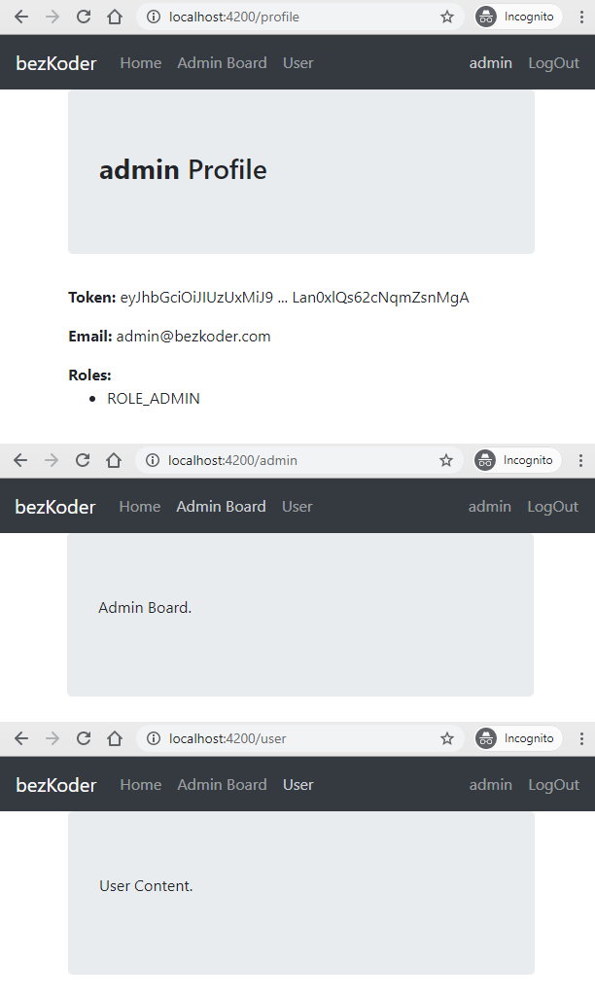
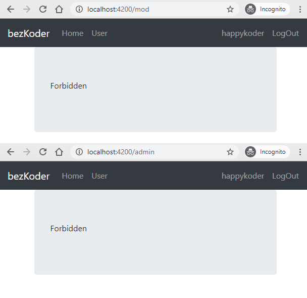
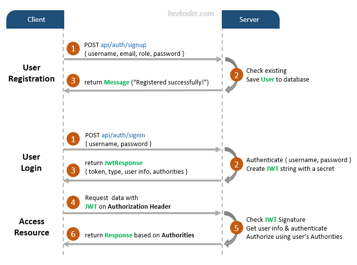
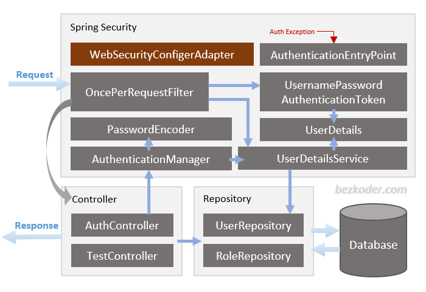

In this tutorial, I will show you how to build a full stack Angular 11 + Spring Boot JWT Authentication example. The back-end server uses Spring Boot with Spring Security for JWT Authentication & Authorization, Spring Data JPA for interacting with database. The front-end will be built using Angular 11 with HttpInterceptor & Form validation.

## Angular 11 Spring Boot JWT Authentication example
It will be a full stack, with Spring Boot for back-end and Angular 11 for front-end. The system is secured by Spring Security with JWT Authentication.

User can signup new account, login with username & password.
Authorization by the role of the User (admin, moderator, user)
Screenshots
Here are UI screenshots of our system.

– Anyone can access a public page before logging in:

– New user registration:

– Signup Form Validation:

– After signup is successful, User can login:

-Loggedin User can access Profile page/ User page:

– This is UI for **admin**:

– If a User who doesn’t have Admin role tries to access **Admin**/**Moderator Board** page:

## Demo
This is full Angular + Spring Boot JWT authentication demo (with form validation, check signup username/email duplicates, test authorization with 3 roles: Admin, Moderator, User).

## Flow for User Registration and User Login
The diagram shows flow for User Registration process and User Login process.

It’s not too difficult to understand. We have 2 endpoints for authentication:

* `api/auth/signup` for User Registration
* `api/auth/signin` for User Login

If Client wants to send request to protected data/endpoints, a legal JWT must be added to HTTP Authorization Header.

## Spring Boot & Spring Security for Back-end

## Angular 11 for Front-end

For more details, please visit:
[https://bezkoder.com/angular-11-spring-boot-jwt-auth/](https://bezkoder.com/angular-11-spring-boot-jwt-auth/)